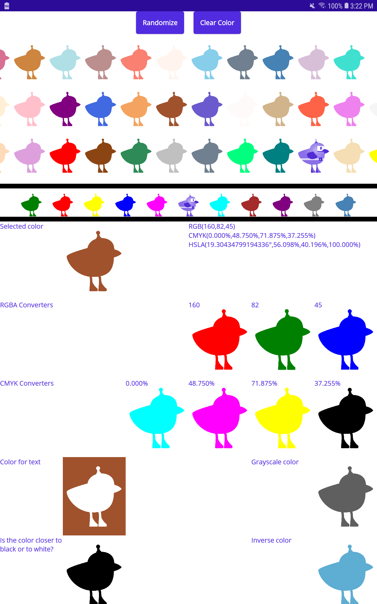

# Proyecto MAUIChicken_MCT_ColorConverter [Spanish]

Este es una aplicación demo con [.NET MAUI](https://github.com/dotnet/maui) utilizando los conversores de color de [MAUI Community Toolkit](https://github.com/CommunityToolkit/Maui/).

Este repositorio es un complemento del blog [Pollitos de Maui](https://pollitosdemaui.wordpress.com/)

## Requerimientos de Software

Para que la aplicación funcione vas a necesitar:

* .NET 6 Preview
    * .NET MAUI y los SDKs de las plataformas
* Visual Studio 17.00 Preview 7.0 (seguro corre con menos, pero con esta está probada)

La manera más sencilla de tener .NET 6 Preview es instalar [Visual Studio 2022 Preview](https://visualstudio.microsoft.com/vs/preview/) (asegurate de tildar la casilla de `Maui-Preview`). Para más info sobre la instalación, mirar [acá](https://docs.microsoft.com/en-us/dotnet/maui/get-started/installation).

------------

------------

# MAUIChicken_MCT_ColorConverter Project  [English]

This is a [.NET MAUI](https://github.com/dotnet/maui) demo application using Color Converters from [MAUI Community Toolkit](https://github.com/CommunityToolkit/Maui/).

This is a complement of the blog [Pollitos de Maui](https://mauichicken.wordpress.com/)

## Software Requirements

To run this app, you'll need:

* .NET 6 Preview
    * .NET MAUI and platform SDKs
* Visual Studio 17.00 Preview 7.0 (might work with older, but this one is tested)
* A [Particle build](https://build.particle.io/build) account

The easiest way to get .NET 6 Preview is to install [Visual Studio 2022 Preview](https://visualstudio.microsoft.com/vs/preview/) (make sure to check the `Maui-Preview` checkbox). Get more information about the installation [here](https://docs.microsoft.com/en-us/dotnet/maui/get-started/installation).
